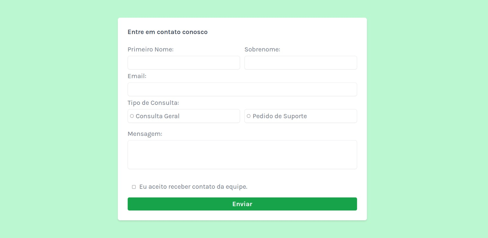
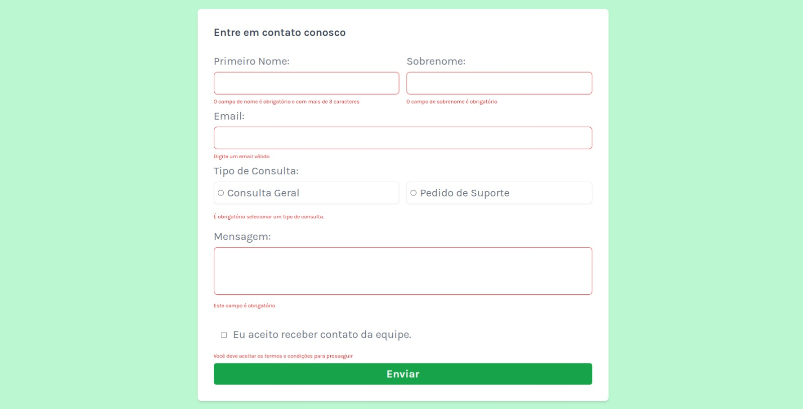
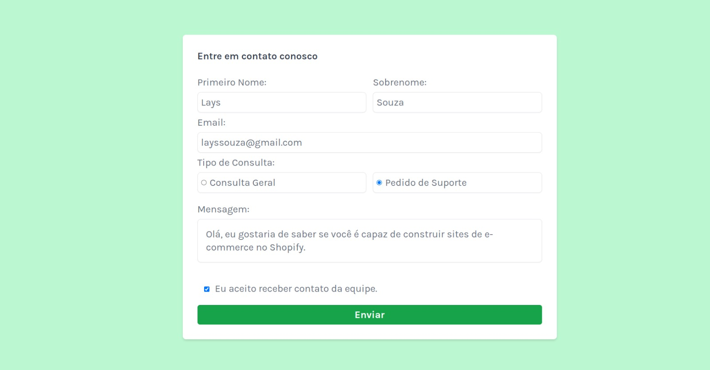
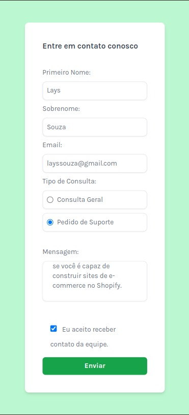
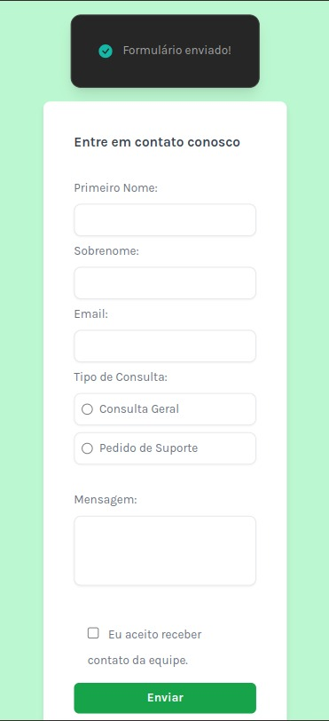
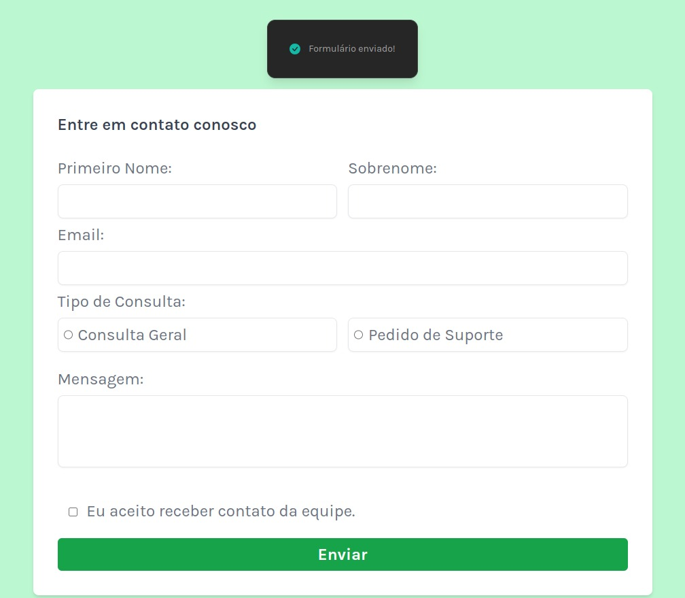

# Formulário de Contato - Frontend Mentor

Esta é a minha solução para o desafio de Formulário de Contato no [Frontend Mentor](https://www.frontendmentor.io/challenges/contact-form--G-hYlqKJj). Desafio do Front end Mentor para aprimorar minhas habilidades com tecnologia de Front end.

## Conteúdos do meu projeto
- [Visão Geral](#visao-geral)
- [O Desafio](#o-desafio)
- [Screenshot](#screenshot)
- [Links](#links)
- [Meu Processo](#meu-processo)
- [Tecnologias](#tecnologias)
- [O que eu aprendi nesse projeto](#o-que-eu-aprendi-nesse-projeto)
- [Autora](#autora)

## Visão Geral

### O Desafio

Os usuários devem ser capazes de:

- Preencher o formulário e ver uma mensagem de sucesso (toast) após o envio bem-sucedido
- Receber mensagens de validação do formulário se:
  - Um campo obrigatório não for preenchido
  - O endereço de e-mail estiver formatado incorretamente
- Preencher o formulário apenas usando o teclado
- Ter os campos de entrada, mensagens de erro e a mensagem de sucesso anunciados no leitor de tela
- Visualizar o layout otimizado para a interface, dependendo do tamanho da tela do dispositivo
- Ver os estados de hover e focus para todos os elementos interativos na página

### Screenshot

<!-- ### Links

- Solution URL: [Add solution URL here](https://your-solution-url.com)
- Live Site URL: [Add live site URL here](https://your-live-site-url.com) -->

## Meu Processo

### Tecnologias

- HTML5 
- Tailwind
- Flexbox
- Mobile-first 
- Javascript

### O que eu aprendi nesse projeto

Durante o desenvolvimento deste projeto, aprimorei minhas habilidades em validação de formulários web utilizando JavaScript. Além disso, implementei a estilização e a responsividade do layout com o uso do Tailwind CSS. No backend, utilizei Node.js com o framework Express para estruturar as rotas e a lógica do servidor. Também implementei uma conexão com um banco de dados MongoDB utilizando o Mongoose, garantindo uma integração eficiente e escalável para o armazenamento dos dados do formulário. Durante o desenvolvimento, adotei metodologias ágeis, como o Kanban, para organizar e acompanhar o progresso das tarefas, e utilizei o Git para versionamento de código, assegurando a rastreabilidade e a colaboração no projeto. 

## Autora

- Linkedin - [Lays Souza](https://www.linkedin.com/in/lays-souza-desenvolvedora/)
- Frontend Mentor - [@souzlays](https://www.frontendmentor.io/profile/souzlays)

